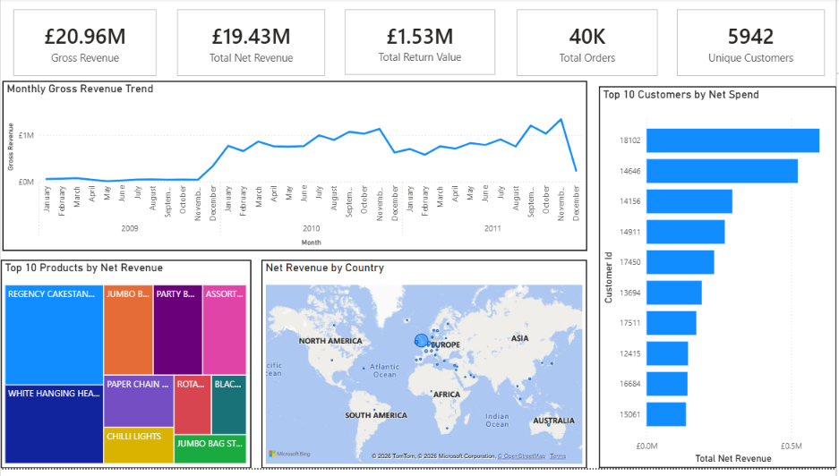

# Retail Sales Analysis Using MySQL & Power BI

An end-to-end data analytics project analysing over 1 million retail transactions using MySQL for data analysis and Power BI for interactive dashboard development to uncover sales trends, customer purchasing behaviour, product performance, and actionable business insights.

## Project Overview

This project analyses the Online Retail II dataset, a publicly available transactional dataset from a UK-based online retailer covering transactions between January 2009 and December 2011. Using MySQL for data cleaning and business analysis and Power BI for interactive dashboard development, the project follows a structured analytics workflow including data import, data auditing, data cleaning, exploratory data analysis (EDA), SQL-based business analysis, KPI development, and dashboard visualisation. The objective is to transform raw transactional data into meaningful business insights by analysing revenue trends, customer purchasing behaviour, product performance, and geographic sales distribution while demonstrating practical SQL, Power BI, and data visualisation skills used in modern business intelligence.

## Dataset Overview

The analysis is based on the **Online Retail II** dataset, which contains transactional records from a UK-based online retailer.

### Dataset Summary

| Metric | Value |
|---------|------:|
| Time Period | 12 January 2009 – 10 December 2011 |
| Total Transactions | 1,067,365 |
| Unique Customers | 5,942 |
| Countries Represented | 43 |
| Primary Market | United Kingdom |

The dataset includes invoice-level information such as product details, quantities purchased, transaction dates, customer IDs, unit prices, and country information.

## Tools & Technologies

| Category | Tool |
|----------|------|
| Database | MySQL |
| SQL Client | MySQL Workbench |
| Business Intelligence | Power BI |
| Language | SQL |
| Version Control | Git & GitHub |
| Dataset | Online Retail II |

## Data Cleaning Process

Before performing the analysis, the dataset was audited and cleaned to improve data quality and ensure reliable results.

The following data preparation steps were completed:

- Imported and combined multiple yearly datasets into a single MySQL table.
- Converted raw invoice date values into a standardized datetime format using STR_TO_DATE().
- Identified and handled missing values in customer IDs and product descriptions.
- Excluded invalid records such as stock code B, empty descriptions, and non-product transactions (e.g., POSTAGE, DOTCOM POSTAGE, and Manual) where appropriate.
- Separated sales and returns by treating positive quantities as purchases and negative quantities as returned items.
- Used conditional aggregation (CASE WHEN) to calculate gross revenue, return value, and net revenue.
- Validated the cleaned dataset before performing business analysis.

## Business Questions

The analysis was conducted to answer the following business questions:

1. How did monthly gross revenue, return value, and net revenue change over time?
2. Which products generated the highest net revenue?
3. Which products sold the highest number of units?
4. Who are the top 10 customers by net spending?
5. Which countries generated the highest net revenue?
6. Which customers placed the highest number of orders?
7. Which customers have the highest average order value (minimum 10 orders)?
8. Which calendar months generated the highest average gross revenue, return value, and net revenue?

## Key Findings

The SQL analysis revealed several important business insights:

- Sales consistently increased during the second half of each year, with November recording the highest average net revenue across the three-year period.
- The United Kingdom was the retailer's primary market, generating the vast majority of total revenue compared to all other countries.
- A small number of products contributed a significant proportion of overall revenue, highlighting the importance of best-selling items.
- Customer spending was highly concentrated, with a relatively small group of customers accounting for the highest net sales.
- Customer purchasing behaviour varied considerably, with some customers placing a large number of orders while others generated exceptionally high average order values.
- Product returns had a measurable impact on revenue, making it important to evaluate both gross and net sales rather than revenue alone.

## Dashboard Preview

## Skills Demonstrated

- SQL data cleaning and transformation
- Exploratory Data Analysis (EDA)
- Data validation and quality assurance
- Business intelligence reporting
- Power BI dashboard development
- DAX measure creation
- KPI design and performance reporting
- Data visualisation
- Business insight generation
- Git & GitHub version control

## How to Run the Project

1. Download the Online Retail II dataset.
2. Import the dataset into MySQL using MySQL Workbench.
3. Create the required database and import the transaction data.
4. Open and execute the `Retail Sales Analysis.sql` script to reproduce the data cleaning and business analysis.
5. Open the `Retail Sales Dashboard.pbix` file in Power BI Desktop.
6. Refresh the data source if required and explore the interactive dashboard.

## Future Improvements

Potential enhancements for this project include:

- Perform customer segmentation using RFM (Recency, Frequency, Monetary) analysis.
- Build sales forecasting models to predict future revenue trends.
- Create SQL views and stored procedures to simplify reporting and improve reusability.
- Automate the data import and cleaning process using ETL workflows.
- Enhance the Power BI dashboard with drill-through pages, bookmarks, and advanced interactivity.
